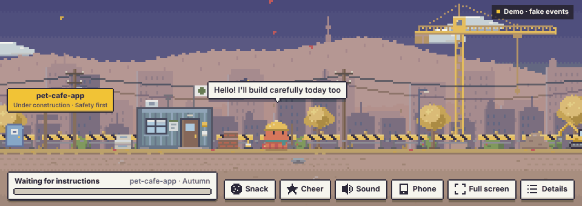
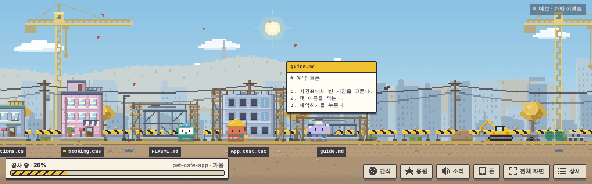
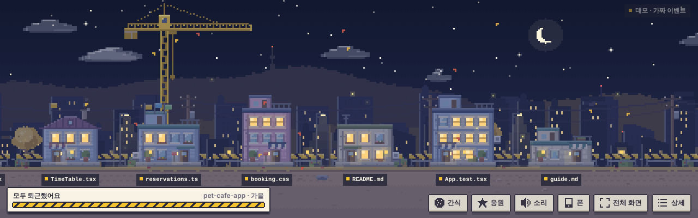

# Construction Site Pets

[한국어](README.md) · English

> An unofficial fan project. Not made or endorsed by Anthropic.



A view-only viewer that shows Claude Code at work as cute pixel pets on a construction site instead of a terminal.
Each file is a building, and every time Claude edits a file an orange octopus pet swings its hammer.

- View-only. It does not change what Claude Code does or how fast it works.
- No external packages, image files, or sound files. Node and a browser are all it needs.
- Runs on this PC only by default (127.0.0.1). Prompts and code are never written to disk.
- Works on Windows, macOS, and Linux. One **Phone** button shows it on a phone on the same Wi-Fi.
- Opens in its own window without an address bar, not as a browser tab. You pick the window shape (strip, 16:9, tall, and so on).
- Screen text and pet lines come in Korean and English.

| Three pets at work by day | After everyone went home |
| --- | --- |
|  |  |

## Try it first

Open `demo.html` in a browser to watch it run on fake events, with no server.
Use **Details → Settings** in the lower right to switch language and preview seasons and events by date.

## Install

You need Claude Code, Node.js 18 or later (20 or later to run the tests), and a browser. The dedicated window uses Edge, Chrome, Whale, or Brave; Windows ships with Edge.

### Straight from GitHub (easiest)

```
claude plugin marketplace add sedolkang21/my-ai-wears-a-hardhat-AI-
claude plugin install construction-pets@construction-pets
claude plugin install construction-pets-button@construction-pets    (button, optional)
```

For a new version: `claude plugin marketplace update construction-pets`, then `claude plugin update construction-pets@construction-pets`, then restart Claude Code.
The sections below install from a zip or a downloaded folder instead.

### Windows

1. Decide where the unzipped folder lives, for example `C:\Users\me\construction-pets`. Later versions are unzipped over the same place.
2. Open PowerShell and check Node: `node -v` should print a version. If not, install the LTS from nodejs.org and reopen PowerShell.
3. Register and install:

   ```
   claude plugin marketplace add C:\Users\me\construction-pets
   claude plugin install construction-pets@construction-pets
   ```

4. Optional button (Claude Code terminal v2.1.287 or later, desktop app v2.1.286 or later):

   ```
   claude plugin install construction-pets-button@construction-pets
   ```

If you run Claude Code inside WSL, run these commands inside WSL with WSL paths. The window opens on the Windows side.

### macOS, Linux

```
claude plugin marketplace add /path/to/the/folder
claude plugin install construction-pets@construction-pets
claude plugin install construction-pets-button@construction-pets    (button, optional)
```

### Upgrading from 0.2.0

1. Unzip the new version over the old folder.
2. Run:

   ```
   claude plugin marketplace update construction-pets
   claude plugin update construction-pets@construction-pets
   claude plugin update construction-pets-button@construction-pets    (if you installed the button)
   ```

3. Close every Claude Code session, wait about 30 seconds, and start again. The new version starts once the old server has shut down.
   (From 0.3.0 on, a new version stops the old server by itself, so there is no waiting.)

### One session without installing

```
claude --plugin-dir C:\Users\me\construction-pets\plugins\construction-pets
```

## How to use

1. When Claude Code starts, the server starts in the background and prints one line: `Construction site viewer: http://127.0.0.1:47821`.
2. Type just `construction site` (or `공사현장`) in the prompt box and the viewer window opens. This input never reaches Claude, so it uses no tokens.
   With the button mod installed, the **Construction site** button above the prompt and the `/construction-site` command do the same.
3. Give Claude work as usual and watch.

### The viewer window

- The viewer opens in its **own window** with no address bar or tabs. It starts as a wide strip (1280×400) that sits nicely above or below your work.
- **Details → Settings → Window shape** offers Strip, 21:9, 16:9, 4:3, 1:1, and Tall. Picking one resizes the window right away. Dragging the window edge works too, and that size is used the next time it opens.
- Opening it again brings up a new window and the earlier one closes itself, so there is always one.
- The window is launched with Edge, Chrome, Whale, or Brave, whichever is installed, using a separate profile (`window-profile` in the data folder) so it does not mix with your everyday browser. To use another browser, set the `CONSTRUCTION_PETS_BROWSER` environment variable to its executable.
- To open it as a browser tab like before, turn off **Settings → Open in its own window**. It also falls back to a tab when none of those browsers is found.

### Language

Pick 한국어 or English in **Details → Settings → Language**. Until you pick, it follows the PC language.
Screen text, pet lines, event banners, and the startup message all switch. A phone can choose its own language.

| On screen | Meaning |
| --- | --- |
| Building | One file. Edits take it from groundwork → frame → walls → roof, and it is completed when the turn ends. Longer files get more floors. |
| Progress bar | Share of the task list that is done. Without a task list it is a rough estimate from tool use. |
| Sky | Dawn → day → dusk → night as progress grows. Completed buildings light their windows. |
| Orange octopus | The Claude pet. |
| Small octopus | A subagent. Helmet colors tell them apart. |
| Little robot, fluffy cloud | The GPT pet and the pet for other AIs. For now they appear only in the demo and fake events. |
| Pet with a raised hand | Waiting for permission. |
| Smoking building | A tool failed. |

| Things to try | How |
| --- | --- |
| See what a pet is doing | Click the pet. You can name it there too. |
| Pet it | Rub the mouse over a pet, or press **Pet** on its card. |
| Give a snack | Press **Snack**, then click the ground. The pet gets excited and looks faster (real work speed does not change). |
| Move or throw | Drag a pet and let go. |
| Look at a file | Click a building. Only files Claude touched in this session, read-only. |
| Cheer | Press **Cheer**. |
| Sound | Press **Sound** for retro console-style effects and music. Off by default. |
| Details | Press **Details** or the `D` key. Three tabs: Site (tasks, recent edits), Pets, Settings (language, window shape, sound, date preview). |
| Full screen | Press **Full screen**. The button appears only where the browser supports it. |

Everything here happens inside the viewer. Nothing is sent to Claude Code.

## Watch on your phone

While Claude Code works on the PC, a phone on the same Wi-Fi can watch the site.

1. Press the **Phone** button at the bottom of the viewer on the PC. The QR code appears immediately.
2. If Windows asks whether to allow Node.js on the network, allow it for **private networks** (first time only).
3. Scan the QR code with the phone camera.

Use **Add to Home Screen** in the phone browser and from then on one tap on that icon opens it.
Phone viewing stays on until you turn it off (same address after restarting the PC), and the **Phone** button stays yellow.

Good to know:

- The phone can only watch. Tapping pets, petting, snacks, throwing, cheering, and sound work; naming, settings, and full file view are PC-only.
- The address contains a key. Any device that knows it can see the site (file names, the first 10 lines of an edit, the first 60 characters of a prompt). **Turn off phone viewing** removes the address, and turning it on again creates a new key (so the home screen icon has to be added again).
- If the router gives the PC a new address (IP), the home screen icon stops working. Scan the QR code again.
- The connection is unencrypted (http). Turn it on only on Wi-Fi you trust, such as home or office, not on public Wi-Fi.
- With several adapters (virtual machines, VPN) several addresses are listed. If one does not open, pick another.

## Seasons

Short events are layered over long seasonal backdrops, by the PC date.

- 4 seasons: spring (cherry blossoms), summer (parasol, showers), autumn (foliage), winter (snow, roasted sweet potato drum)
- 10 events: New Year, Seollal, Valentine · White Day, April Fools' Day, Children's Day, Chuseok, Hangul Day, Halloween, Christmas, birthday
- Enter your birthday as `MM-DD` in **Details → Settings**.
- Preview: **Details → Settings → Date preview**, or add `?date=2026-12-25` to the address.

## Customize

| File | What you can change |
| --- | --- |
| `plugins/construction-pets/config/pets.json` | Pet colors, default names, personalities (walk speed, work tempo, lines, rest behavior), helmet colors. Names and lines have `ko` and `en` versions |
| `plugins/construction-pets/config/seasons.json` | Season and event dates, events to turn off (`disabled`), the lunar date table |
| `plugins/construction-pets/skins/` | Pet skins, including the earlier rabbit and cat. See `skins/README.md` (Korean) |
| `plugins/construction-pets/viewer/js/i18n.js` | Screen text (Korean, English) |

Reload the viewer after editing.

## Troubleshooting

- **I want to check it on Windows first.** Run `npm test` in the unzipped folder; 26 tests should pass. Tell me the name of any that fails.
- **No window opens.** Open `http://127.0.0.1:47821` in a browser yourself. If only the dedicated window misbehaves, turn off **Settings → Open in its own window** to get a tab like before.
- **The window opens at an odd size.** Pick a shape in **Settings → Window shape** and it snaps back.
- **The window shows a welcome or sign-in page first.** That is the browser setting up the separate profile for the first time. Close it and it will not come back. If it keeps appearing, turn off **Open in its own window**.
- **The phone cannot connect.** Check that phone and PC are on the same Wi-Fi and that the Windows network is set to Private. If you missed the firewall prompt, run this once in an administrator PowerShell:

  ```
  netsh advfirewall firewall add rule name="construction-pets" dir=in action=allow protocol=TCP localport=47822 profile=private
  ```

  It will not open on networks that block devices from talking to each other, such as guest Wi-Fi or some office networks. With Claude Code inside WSL the phone may not reach it either.
- **Hook connection errors appear.** The session is continuing while the server is off. Work is not blocked. Start a new session and the server comes back.
- **The server never starts.** Check `node -v` in PowerShell first. If another program uses port 47821 the server quietly steps aside. Close that program, or change the port in `hooks.json`, `server.js`, and `start.js` together.
- **It does not work on a company PC.** It will not run if the organization restricts HTTP hook addresses (`allowedHttpHookUrls`) or blocks plugin hooks (`allowManagedHooksOnly`).
- **I want to turn it off.** `claude plugin disable construction-pets@construction-pets`.

## Privacy

- The server binds to 127.0.0.1 by default and rejects requests from other sites.
- Only when phone viewing is on does it open a read-only port (47822) on the local network. The key must match, and it only serves the view.
- It sends the viewer only the first 60 characters of a prompt and the first 10 lines of an edit.
- On disk it keeps only pet names and settings (language, window size, auto-open, startup message, birthday, phone viewing state and key).
- The dedicated window adds a browser profile (`window-profile`) in the same folder. It holds the browser's own settings and cache; the server marks every response `no-store` so code does not stay in that cache. Deleting it is safe.
- Nothing is sent outside.

## About the pet designs

The Claude pet is pixel art drawn in code after Claude's orange mascot. No official images or logos are included.
The GPT pet (a little robot) and the pet for other AIs (a fluffy cloud) are original and are not modeled on any company's character.
Before redistributing it elsewhere, check Anthropic's brand guidelines and, if needed, swap the look in `skins/`.

## License

[MIT](LICENSE). Use, change, and share the code and art freely.
The license does not grant any rights to the names, trademarks, or mascot of Claude or Anthropic.
