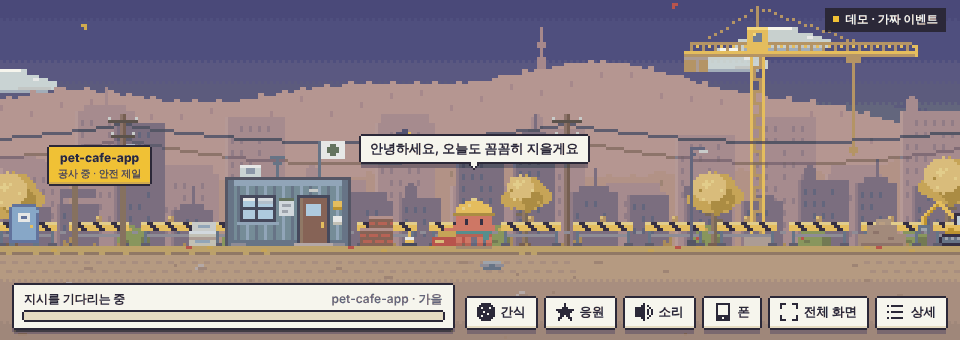

# 공사현장 펫 뷰어

한국어 · [English](README.en.md)

> 비공식 팬 프로젝트입니다. Anthropic이 만들거나 보증한 것이 아닙니다.



Claude Code가 일하는 모습을 터미널 대신, 귀여운 펫들이 공사하는 픽셀 화면으로 보여주는 보기 전용 뷰어입니다.
파일 하나가 건물 한 채이고, Claude가 파일을 고칠 때마다 주황 문어 펫이 망치질을 합니다.

- 보기 전용입니다. Claude Code의 작업 내용과 속도에 영향을 주지 않습니다.
- 외부 패키지, 이미지 파일, 소리 파일이 없습니다. Node와 브라우저만 있으면 됩니다.
- 기본은 이 PC 안에서만 동작합니다(127.0.0.1). 프롬프트와 코드를 디스크에 저장하지 않습니다.
- Windows, macOS, Linux에서 쓸 수 있고, **폰** 버튼 하나로 같은 와이파이의 폰에서도 볼 수 있습니다.
- 브라우저 탭이 아니라 주소창 없는 전용 창으로 뜹니다. 창 모양(가로 띠, 16:9, 세로 등)은 고를 수 있습니다.
- 화면 글자와 펫 대사는 한국어와 영어를 지원합니다.

| 세 펫이 함께 일하는 낮 | 모두 퇴근한 밤 |
| --- | --- |
|  |  |

## 먼저 구경하기

`demo.html`을 브라우저로 열면 서버 없이 가짜 이벤트로 돌아가는 모습을 볼 수 있습니다.
오른쪽 아래 **상세 → 설정**에서 언어를 바꾸고, 날짜 미리보기로 계절과 행사를 바꿔 볼 수 있습니다.

## 설치

필요한 것: Claude Code, Node.js 18 이상(시험을 돌리려면 20 이상), 브라우저(전용 창은 Edge, Chrome, Whale, Brave 중 하나가 있으면 됩니다. Windows에는 Edge가 기본으로 있습니다).

### GitHub에서 바로 설치 (가장 쉬움)

```
claude plugin marketplace add sedolkang21/my-ai-wears-a-hardhat-AI-
claude plugin install construction-pets@construction-pets
claude plugin install construction-pets-button@construction-pets    (버튼, 선택)
```

새 버전이 나오면 `claude plugin marketplace update construction-pets` → `claude plugin update construction-pets@construction-pets` 뒤에 Claude Code를 다시 시작합니다.
아래는 압축 파일이나 내려받은 폴더로 설치하는 방법입니다.

### Windows

1. 압축을 풀어 둘 곳을 정합니다. 예: `C:\Users\내이름\construction-pets`
   나중에 새 버전으로 올릴 때 같은 자리에 덮어쓰게 되니 먼저 자리를 정하세요.
2. PowerShell을 열고 Node가 있는지 확인합니다. 버전이 나오면 됩니다.

   ```
   node -v
   ```

   없으면 nodejs.org에서 LTS를 설치하고 PowerShell을 다시 엽니다.
3. 등록하고 설치합니다.

   ```
   claude plugin marketplace add C:\Users\내이름\construction-pets
   claude plugin install construction-pets@construction-pets
   ```

4. 버튼도 쓰려면(선택, Claude Code 터미널 v2.1.287 이상 또는 데스크톱 앱 v2.1.286 이상):

   ```
   claude plugin install construction-pets-button@construction-pets
   ```

Claude Code를 WSL 안에서 쓴다면 위 명령도 WSL 안에서, WSL 쪽 경로로 실행합니다. 창은 Windows 쪽에서 열립니다.

### 0.2.0에서 올리기

1. 새 압축을 예전과 같은 자리에 덮어씁니다.
2. 아래를 실행합니다.

   ```
   claude plugin marketplace update construction-pets
   claude plugin update construction-pets@construction-pets
   claude plugin update construction-pets-button@construction-pets    (버튼을 설치했다면)
   ```

3. 열려 있는 Claude Code를 모두 닫고 30초쯤 뒤에 다시 시작합니다. 예전 서버가 꺼진 뒤에 새 버전이 뜨기 때문입니다.
   (0.3.0부터는 새 버전이 예전 서버를 알아서 내리므로 기다리지 않아도 됩니다.)

### macOS, Linux

```
claude plugin marketplace add /풀어/둔/폴더
claude plugin install construction-pets@construction-pets
claude plugin install construction-pets-button@construction-pets    (버튼, 선택)
```

### 설치하지 않고 한 세션만 써 보기

```
claude --plugin-dir C:\Users\내이름\construction-pets\plugins\construction-pets
```

## 쓰는 법

1. Claude Code를 시작하면 서버가 뒤에서 켜지고 `공사현장 뷰어: http://127.0.0.1:47821` 안내가 한 줄 나옵니다.
2. 프롬프트 창에 `공사현장`이라고만 입력하면 뷰어 창이 뜹니다(영어로는 `construction site`). 이 입력은 Claude에게 가지 않아서 토큰을 쓰지 않습니다.
   버튼 mod를 설치했다면 프롬프트 위의 **공사현장 보기** 버튼이나 `/construction-site` 명령도 같은 일을 합니다.
3. 평소처럼 일을 시키고 구경합니다.

### 뷰어 창

- 뷰어는 브라우저 탭이 아니라 주소창과 탭이 없는 **전용 창**으로 뜹니다. 처음에는 가로로 긴 띠 모양(1280×400)이라 작업 창 위나 아래에 두고 보기 좋습니다.
- **상세 → 설정 → 창 모양**에서 가로 띠, 21:9, 16:9, 4:3, 1:1, 세로 중에 고르면 창 크기가 바로 바뀝니다. 창 가장자리를 끌어서 바꿔도 그 크기를 기억했다가 다음에 그대로 엽니다.
- 다시 열면 새 창이 뜨고 먼저 떠 있던 창은 스스로 닫힙니다(창은 늘 하나).
- 전용 창은 PC에 있는 Edge, Chrome, Whale, Brave 중 하나로 띄웁니다. 평소 쓰는 브라우저와 섞이지 않게 전용 프로필(설정 폴더의 `window-profile`)을 씁니다. 다른 브라우저를 쓰고 싶으면 환경 변수 `CONSTRUCTION_PETS_BROWSER`에 실행 파일 경로를 적습니다.
- 예전처럼 브라우저 탭으로 열고 싶으면 **설정 → 전용 창으로 열기**를 끕니다. 위 브라우저가 하나도 없을 때도 탭으로 열립니다.

### 언어

**상세 → 설정 → 언어**에서 한국어와 English를 고릅니다. 고르기 전에는 PC 언어를 따릅니다.
화면 글자, 펫 대사, 행사 현수막, 시작 안내문이 함께 바뀝니다. 폰은 폰에서 따로 고를 수 있습니다.

| 화면에서 | 뜻 |
| --- | --- |
| 건물 | 파일 하나. 고칠수록 터닦기 → 골조 → 벽 → 지붕 순서로 올라가고, 턴이 끝나면 준공합니다. 파일이 길수록 층이 높습니다. |
| 진행률 바 | 작업 목록의 완료 비율. 작업 목록이 없으면 도구 사용 횟수로 대략만 보여줍니다. |
| 하늘 | 진행률에 따라 새벽 → 낮 → 노을 → 밤. 준공하면 창에 불이 켜집니다. |
| 주황 문어 | Claude 펫. |
| 작은 문어 | 서브에이전트. 헬멧 색으로 구분합니다. |
| 꼬마 로봇, 뭉게구름 | GPT 펫과 그 밖의 AI 펫. 지금은 데모와 가짜 이벤트에서만 나옵니다. |
| 손 든 펫 | 권한을 기다리는 중입니다. |
| 연기 나는 건물 | 도구가 실패했습니다. |

| 해볼 수 있는 것 | 방법 |
| --- | --- |
| 지금 하는 일 보기 | 펫을 누릅니다. 이름도 여기서 지어 줍니다. |
| 쓰다듬기 | 펫 위에서 마우스를 문지르거나, 펫 카드의 **쓰다듬기**를 누릅니다. |
| 간식 주기 | **간식**을 누른 뒤 땅을 누릅니다. 펫이 잠깐 신나서 빨라집니다(실제 작업 속도는 그대로입니다). |
| 옮기기, 던지기 | 펫을 끌었다가 놓습니다. |
| 파일 보기 | 건물을 누릅니다. 이번 세션에서 Claude가 다룬 파일만, 읽기 전용으로 보여줍니다. |
| 응원 | **응원**을 누릅니다. |
| 소리 | **소리**를 누르면 레트로 게임기풍 효과음과 배경 음악이 켜집니다. 기본은 꺼져 있습니다. |
| 상세 보기 | **상세**를 누르거나 `D` 키. 현장(작업 목록, 방금 고친 코드), 펫, 설정(언어, 창 모양, 소리, 날짜 미리보기) 세 탭이 있습니다. |
| 전체 화면 | **전체 화면**을 누릅니다. 지원하는 브라우저에서만 버튼이 보입니다. |

여기서 하는 일은 모두 뷰어 안에서만 일어나고, Claude Code로는 아무것도 전달하지 않습니다.

## 폰에서 보기

PC에서 Claude Code가 일하는 동안, 같은 와이파이에 있는 폰으로 공사장을 볼 수 있습니다.

1. PC의 뷰어 아래쪽 **폰** 버튼을 누릅니다. 누르는 즉시 QR이 뜹니다.
2. Windows가 "Node.js의 네트워크 접근을 허용할까요?"라고 물으면 **개인 네트워크**에 허용합니다(처음 한 번).
3. QR을 폰 카메라로 찍습니다.

폰 브라우저에서 **홈 화면에 추가**를 해 두면 다음부터는 홈 화면의 아이콘 하나로 바로 열립니다.
폰에서 보기는 끄기 전까지 켜져 있고(PC를 다시 켜도 같은 주소), **폰** 버튼이 노랗게 표시됩니다.

알아둘 것:

- 폰에서는 보기만 됩니다. 펫 누르기, 쓰다듬기, 간식, 던지기, 응원, 소리는 되고, 이름 짓기와 설정, 파일 전체 보기는 PC에서만 됩니다.
- 주소에는 열쇠가 들어 있습니다. 이 주소를 아는 기기는 공사장(파일 이름, 고친 코드 앞 10줄, 프롬프트 앞 60자)을 볼 수 있습니다. **폰에서 보기 끄기**를 누르면 주소가 사라지고, 다시 켜면 새 열쇠가 만들어집니다(홈 화면 아이콘도 새로 만들어야 합니다).
- 공유기가 PC의 주소(IP)를 바꾸면 홈 화면 아이콘이 열리지 않습니다. 그때는 QR을 다시 찍으세요.
- 암호화하지 않은 연결(http)입니다. 집이나 사무실처럼 믿을 수 있는 와이파이에서만 켜세요. 카페 같은 공용 와이파이에서는 켜지 마세요.
- 폰 화면이 꺼지는 시간은 폰 설정을 따릅니다.
- PC에 어댑터가 여럿이면(가상 머신, VPN 등) 주소가 여러 개 나옵니다. 안 열리면 다른 주소를 골라 보세요.

## 시즌

PC 날짜에 맞춰 긴 계절 배경 위에 짧은 행사가 덧씌워집니다.

- 계절 4종: 봄(벚꽃), 여름(파라솔, 소나기), 가을(단풍), 겨울(눈, 군고구마 통)
- 행사 10종: 새해, 설날, 발렌타인·화이트데이, 만우절, 어린이날, 추석, 한글날, 할로윈, 크리스마스, 생일
- 생일은 **상세 → 설정**에서 `MM-DD`로 적습니다.
- 미리 보기: **상세 → 설정 → 날짜 미리보기**, 또는 주소 뒤에 `?date=2026-12-25`.

## 바꿔 보기

| 파일 | 바꿀 수 있는 것 |
| --- | --- |
| `plugins/construction-pets/config/pets.json` | 펫 색, 기본 이름, 성격(걷는 속도, 일하는 빠르기, 대사, 쉬는 행동), 헬멧 색. 이름과 대사는 `ko`, `en` 두 벌입니다 |
| `plugins/construction-pets/config/seasons.json` | 계절과 행사의 기간, 끌 행사(`disabled`), 음력 날짜표 |
| `plugins/construction-pets/skins/` | 펫 스킨. 예전 토끼와 고양이도 여기 있습니다. `skins/README.md` 참고 |
| `plugins/construction-pets/viewer/js/i18n.js` | 화면 글자(한국어, 영어) |

고친 뒤 뷰어를 새로 고치면 반영됩니다.

## 문제가 생기면

- **Windows에서 잘 되는지 먼저 확인하고 싶어요.** 풀어 둔 폴더에서 `npm test`를 돌리면 26개가 통과해야 합니다. 실패한 항목 이름을 알려 주시면 고치겠습니다.
- **창이 안 떠요.** 주소 `http://127.0.0.1:47821`을 브라우저로 직접 여세요. 전용 창만 말썽이면 **설정 → 전용 창으로 열기**를 끄면 예전처럼 탭으로 열립니다.
- **전용 창이 이상한 크기로 떠요.** **설정 → 창 모양**에서 하나를 고르면 그 크기로 돌아옵니다.
- **전용 창이 처음에 환영 화면이나 로그인 안내를 보여줘요.** 전용 프로필을 처음 만들 때 브라우저가 띄우는 화면입니다. 닫으면 다음부터는 나오지 않습니다. 계속 나오면 **전용 창으로 열기**를 끄세요.
- **폰에서 안 열려요.** 폰과 PC가 같은 와이파이인지, Windows 네트워크가 '개인'으로 되어 있는지 확인하세요. 방화벽 허용 창을 놓쳤다면 관리자 PowerShell에서 아래를 한 번 실행합니다.

  ```
  netsh advfirewall firewall add rule name="construction-pets" dir=in action=allow protocol=TCP localport=47822 profile=private
  ```

  손님용 와이파이나 회사망처럼 기기끼리 통신을 막는 네트워크에서는 열리지 않습니다. WSL 안에서 Claude Code를 쓰는 경우에도 폰에서는 닿지 않을 수 있습니다.
- **훅 연결 실패 알림이 떠요.** 서버가 꺼진 채 세션이 이어지는 경우입니다. 작업은 막히지 않습니다. 새 세션을 시작하면 서버가 다시 켜집니다.
- **서버가 아예 안 떠요.** PowerShell에서 `node -v`가 되는지 먼저 확인하세요. 47821 포트를 다른 프로그램이 쓰고 있으면 서버는 조용히 물러납니다. 그 프로그램을 끄거나, `hooks.json`과 `server.js`, `start.js`의 포트를 함께 바꾸세요.
- **회사 PC에서 안 돼요.** 조직이 HTTP 훅 주소를 제한하거나(`allowedHttpHookUrls`) 플러그인 훅을 막아 두면(`allowManagedHooksOnly`) 동작하지 않습니다.
- **끄고 싶어요.** `claude plugin disable construction-pets@construction-pets`.

## 개인정보

- 서버는 기본으로 127.0.0.1에만 붙고, 다른 사이트에서 온 요청은 거절합니다.
- '폰에서 보기'를 켰을 때만 같은 네트워크에 읽기 전용 포트(47822)를 엽니다. 열쇠가 맞아야 하고, 보기만 됩니다.
- 프롬프트는 앞 60자, 코드는 고친 부분 앞 10줄만 뷰어로 보냅니다.
- 디스크에 남기는 것은 펫 이름과 설정(언어, 창 크기, 자동 열기, 시작 안내, 생일, 폰에서 보기 상태와 열쇠)뿐입니다.
- 전용 창을 쓰면 같은 폴더에 브라우저의 프로필(`window-profile`)이 생깁니다. 브라우저가 스스로 쓰는 설정과 캐시이고, 서버는 뷰어 응답에 저장 금지(`no-store`)를 붙여 코드가 캐시에 남지 않게 합니다. 지워도 다시 만들어집니다.
- 바깥으로 보내는 것은 없습니다.

## 펫 디자인에 대해

Claude 펫은 Claude의 주황색 마스코트를 본떠 직접 코드로 그린 픽셀 그림입니다. 공식 이미지와 로고는 들어 있지 않습니다.
GPT 펫(꼬마 로봇)과 그 밖의 AI 펫(뭉게구름)은 어느 회사의 캐릭터도 본뜨지 않은 오리지널입니다.
다른 곳에 다시 배포하려면 Anthropic의 브랜드 사용 조건을 먼저 확인하고, 필요하면 `skins/`에서 다른 모습으로 바꾸세요.

## 라이선스

[MIT](LICENSE). 코드와 그림을 자유롭게 쓰고 고치고 나눠도 됩니다.
다만 이 라이선스가 Claude와 Anthropic의 이름, 상표, 마스코트에 대한 권리까지 주는 것은 아닙니다.
